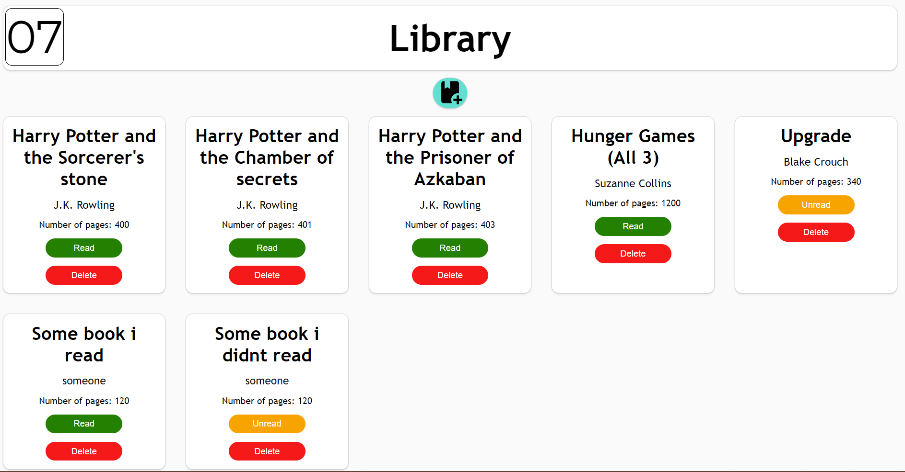

# Library
### An online library that stores information about books for the user. 
### Made using HTML/CSS/JS, an exercise for [TheOdinProject](theodinproject.com)
#### Click on the picture/the link below to try!

## Features: 
1. Can add Book's title, author, page count and read status. 
2. Can delete books from the list. 
3. Can change the read status of a book by clicking on the read button.
4. Can store user's data locally using `localStorage` and `sessionStorage`
5. The webpage is responsive and can be used with mobile phones and computers with different aspect ratios (Experimental)

## What I used/learned: 
1. HTML: forms.
2. CSS: `position: absolute;` , grid: auto-fill, `@media` queries
3. JS: classes, objects, `this` keyword, event listeners, `localStorage` , `sessionStorage`     

